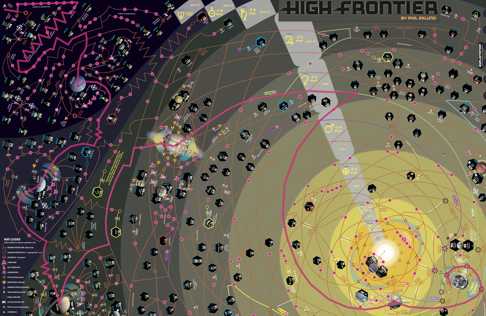

# High Frontier mission planner

This is a ~cheating tool~ mission planner for the board game [High Frontier](https://boardgamegeek.com/boardgame/281655/high-frontier-4-all). It can help you to find the best route from one place in the solar system to another. It's built in the browser, so there's nothing to download or install.

[☞ **Open HF Mission Planner (4th Ed.)**](https://nornagon.github.io/hf-mission-planner)

[☞ **Open HF Mission Planner (3rd Ed.)**](https://nornagon.github.io/hf-mission-planner?ed=3)

For example, this trajectory from LEO to the Sol-Oort exit takes 18 burns, 32 turns, and takes your spacecraft through 2 hazard zone-equivalents (a Saturn ring crossing, and several radiation hazard zones)

## Usage

The tool will load with the view over Earth, where the air is free and the breathing is easy. You can zoom the view with the scroll wheel, and pan by clicking and dragging. To plan a path from one place to another, click the point you want to start from, and the point you wish to end up at. Information about the planned trajectory is shown in the top-right corner. Press <kbd>Esc</kbd> to clear the current trajectory (or just click on a new starting point to plan your next path).

### Edit mode

If you're developing this tool you might want to edit the map data to fix errors or update the map to a new version. You're in luck, HF Mission Planner has an edit mode optimized for fast input (and certainly not for ease of learning or intuitiveness). If you find yourself in a position to use it, the best reference is probably the source code, but here's a list of keyboard shortcuts as of writing:

- <kbd>Tab</kbd> - toggle between edit mode and view mode.
- Click to place a new node. The default node type is Hohmann, indicated by a green circle.
- <kbd>X</kbd> - delete hovered node.
- <kbd>M</kbd> - move hovered node to the current cursor position.
- <kbd>H</kbd> - mark hovered node as Hohmann type.
- <kbd>L</kbd> - mark hovered node as Lagrange type.
- <kbd>B</kbd> - mark hovered node as Burn type. Pressing <kbd>B</kbd> again will cycle through Lander burn, Half-lander burn and regular burn.
- <kbd>R</kbd> - mark hovered node as Radhaz type.
- <kbd>Y</kbd> - mark hovered node as Flyby type. Pressing <kbd>Y</kbd> again will cycle through (+1), (+2), (+3), (+4).
- <kbd>S</kbd> - mark hovered node as Site type. You will be prompted for the name of the site. Pressing <kbd>S</kbd> again will allow you to edit the name of the site.
- <kbd>D</kbd> - mark hovered node as decorative. Decorative nodes are used to make paths follow the underlying map, and have no semantic meaning.
- <kbd>Z</kbd> - mark hovered node as containing a hazard. Works on any node type; hazardousness is orthogonal to node type. Aerobrake nodes are modeled as hazard nodes.
- <kbd>A</kbd> - link two nodes together. The first node which <kbd>A</kbd> is pressed on is stored, and no link is made until a second node is selected by pressing <kbd>A</kbd> on it.
- <kbd>0</kbd>–<kbd>9</kbd> - set label of hovered exit. This operates on the hovered node _and_ the hovered edge, which will be highlighted green. It sets the edge label for that entry/exit on the current node. Note that this can be different at different ends of the same edge. Exit labels are used to indicate which directions can be coasted through in a Hohmann: entering on a path labeled '1' means you can coast out through an exit labeled '1', but switching to a path with a different label costs 2 burns. The edge label '0' is special, and is used to indicate 1-way edges: the planner will never enter a node through an edge marked '0'. This is used to model aerobrake paths, which can only be traversed in one direction.

## Future work

### Path planning heuristics

At present, there is only one available method by which the tool can compare two paths to decide which is 'better', and that's the "burns > turns > hazards" metric. That is, if the planner can save a burn by waiting a turn or taking a hazard, it will. Similarly, if it can save a turn by taking a hazard, it will. Ideally it would be possible to rearrange these goals to minimize hazards over burns, or turns over burns, or any arbitrary ordering. See [#4](https://github.com/nornagon/hf-mission-planner/issues/4).

### Implement the Solar Oberth flyby

Currently, the tool has no way to ask you for the thrust of your vehicle, so it can't calculate the bonus burns you'd get from performing a Solar Oberth maneuver. As such, the node is left unconnected on the graph currently. See [#9](https://github.com/nornagon/hf-mission-planner/issues/9).

Further, once we know the thrust of a vehicle, it's possible we could compute slightly more efficient paths by knowing the maximum number of burns per turn that a vehicle is capable of. Handling multiple engines with differing thrust is probably out of scope for the tool at present—if needed, you can plan two separate paths with different thrusts.

### Represent synodic sites

The tool currently assumes that every site is available at all times, which isn't true in the game. Some sites are "synodic sites", indicated on the map by blue, red or yellow outlines, and it's only possible to enter those sites during the relevant phase of the sun spot cycle. This is particularly relevant for the Venus flyby node, which the planner likes to use for all sorts of missions, but is actually only available 1/3rd of the time. See [#11](https://github.com/nornagon/hf-mission-planner/issues/11).
